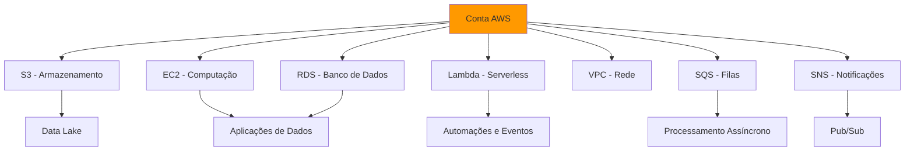

# Bootcamp Cloud para Dados

## 📋 Sobre

Este bootcamp é um **programa completo de Cloud Computing** focado em engenharia de dados. Você aprenderá a implantar aplicações de dados na AWS, desde conceitos fundamentais até projetos práticos completos.

**Objetivo Educacional**: Dominar serviços AWS para implantar e gerenciar aplicações de dados em produção de forma independente.

## 🎯 Objetivos de Aprendizado

- **Fundamentos de Cloud**: Entender computação em nuvem e criar conta AWS
- **AWS Core Services**: Dominar S3, EC2, IAM, VPC, RDS, Lambda, SQS, SNS
- **Arquitetura Serverless**: Construir aplicações serverless com Lambda e eventos
- **Gestão de Custos**: Controlar e otimizar custos na AWS
- **Automação**: Gerenciar AWS via CLI e scripts
- **Projetos Práticos**: Implementar aplicações completas na AWS

## 📚 Conteúdo das Aulas

### Parte 1: AWS - Fundamentos (Aulas 01-08)

#### Aula 01 - Introdução à AWS e Cloud Computing

**Conteúdo Real**:

- Criação de conta AWS e configuração inicial
- Controle de custos (AWS Budgets, Cost Explorer)
- Navegação no AWS Management Console
- Configuração de IAM básico e MFA
- Criação do primeiro bucket S3 e publicação de site estático
- Configuração de instância EC2 e deploy de aplicação Streamlit

**Objetivo**: Introduzir conceitos básicos de cloud computing e publicar primeira aplicação na AWS.

**Resultado**: Conta AWS configurada, site estático no S3 e aplicação rodando em EC2.

---

#### Aula 02 - S3: Armazenamento de Dados na AWS

**Conteúdo Real**:

- Revisão de custos com Cost Explorer e tags
- Conceitos de storage e redundância no S3
- Criação detalhada de buckets S3 (configurações avançadas)
- Recursos avançados: Intelligent-Tiering, Server Access Logging, Event Notifications
- Uso do S3 via Python (boto3): criar buckets, upload/download, políticas
- Casos de uso em engenharia de dados: Data Lake, ETL, backup e arquivamento

**Objetivo**: Dominar Amazon S3 para armazenamento escalável de dados.

**Resultado**: Capacidade de gerenciar dados no S3 programaticamente e aplicar em pipelines de dados.

---

#### Aula 03 - EC2: Computação Escalável na AWS

**Conteúdo Real**:

- Revisão do S3 e integração com EC2
- Conceitos fundamentais do EC2 (instâncias, AMIs, volumes EBS, Security Groups)
- Configuração e lançamento de instâncias EC2
- Acesso via SSH e configuração inicial
- Famílias de instâncias: General Purpose, Compute Optimized, Memory Optimized, Accelerated Computing
- Tipos de preço: On-Demand, Savings Plans, Spot, Dedicadas
- Instalação do Airflow em instância EC2 (passo a passo completo)

**Objetivo**: Dominar EC2 para executar aplicações e processar dados na cloud.

**Resultado**: Capacidade de criar, configurar e gerenciar instâncias EC2 para diferentes workloads.

---

#### Aula 04 - IAM: Gerenciamento de Segurança

**Conteúdo Real**:

- Proteção da conta AWS e usuário root
- Configuração de MFA (Multi-Factor Authentication)
- Criação de usuários administrativos (AdministratorAccess vs PowerUserAccess)
- Criação de grupos IAM (Engenheiro de Dados, Cientista de Dados, Lambda Executors)
- Acesso programático e configuração de credenciais
- IAM Roles para EC2 com acesso ao S3
- Políticas personalizadas e boas práticas

**Objetivo**: Implementar segurança e controle de acesso na AWS.

**Resultado**: Conta AWS segura com usuários, grupos e roles configurados corretamente.

---

#### Aula 05 - VPC: Redes Virtuais na AWS

**Conteúdo Real**:

- Conceitos de VPC (Virtual Private Cloud)
- Sub-redes públicas e privadas
- Internet Gateway (IGW) e NAT Gateway
- VPC Endpoints (Gateway e Interface)
- Configuração completa de VPC do zero
- Tabelas de roteamento e Security Groups
- Projeto prático: Arquitetura segura com EC2 privada acessando S3 via VPC Endpoint

**Objetivo**: Criar redes isoladas e seguras na AWS.

**Resultado**: Capacidade de configurar VPCs completas com sub-redes públicas/privadas e endpoints.

---

#### Aula 06 - VPC: Projeto Prático

**Conteúdo Real**:

- Desafio de negócio: Proteção de dados sensíveis em ambientes regulatórios
- Arquitetura completa: VPC com sub-redes públicas/privadas, Bastion Host, VPC Endpoint para S3
- Estimativa de custos e análise de arquitetura
- Tutorial passo a passo: Criar VPC, sub-redes, IGW, NAT, EC2 pública e privada
- Configuração de acesso SSH via Bastion Host
- Teste de acesso ao S3 via VPC Endpoint

**Objetivo**: Implementar arquitetura de rede segura para processamento de dados sensíveis.

**Resultado**: Arquitetura completa funcionando com segurança e conformidade.

---

#### Aula 07 - RDS: Bancos de Dados Gerenciados

**Conteúdo Real**:

- Conceitos do Amazon RDS
- Funcionalidades: Multi-AZ, Read Replicas, Backup automático
- Configuração passo a passo de instância RDS
- Segurança: Encryption, Security Groups, IAM Authentication
- Criação de VPC do zero para RDS
- Projeto: Instalação do WordPress em EC2 usando RDS
- Gerenciamento de backups e restauração

**Objetivo**: Configurar e gerenciar bancos de dados relacionais na AWS.

**Resultado**: Banco de dados RDS funcional e integrado com aplicações.

---

#### Aula 08 - Integração EC2 e RDS

**Conteúdo Real**:

- Projeto completo: API em Docker rodando em EC2 conectada ao RDS
- Configuração de instância EC2 com Docker
- Deploy de aplicação containerizada
- Configuração de Security Groups para EC2 e RDS
- Integração segura entre aplicação e banco de dados
- Vantagens da arquitetura EC2 + RDS para engenharia de dados

**Objetivo**: Integrar aplicações em EC2 com bancos de dados RDS.

**Resultado**: Aplicação completa funcionando com backend, frontend e banco de dados.

---

### Parte 2: AWS - Serverless e Eventos (Aulas 09-15)

#### Aula 09 - AWS Lambda e Eventos

**Conteúdo Real**:

- Introdução ao AWS Lambda e arquitetura serverless
- Diferenças entre Lambda e EC2
- Casos de uso: processamento de arquivos, ETL em tempo real, APIs serverless
- Eventos na AWS: S3, DynamoDB Streams, API Gateway, CloudWatch, SQS
- Configuração de função Lambda
- Exemplo prático: Primeiro Lambda de teste

**Objetivo**: Entender e usar AWS Lambda para automação serverless.

**Resultado**: Funções Lambda criadas e acionadas por eventos.

---

#### Aula 10 - Gestão de Custos na AWS

**Conteúdo Real**:

- Política de tags focada em governança de custos (5 tags obrigatórias)
- Organização de recursos com tags
- Criação de grupos de recursos baseados em tags
- AWS Cost Explorer com tags
- Configuração de AWS Budgets com base em tags
- AWS Cost Anomaly Detection
- Checklist para evitar surpresas no final do mês

**Objetivo**: Controlar e otimizar custos na AWS.

**Resultado**: Sistema completo de gestão de custos implementado.

---

#### Aula 11 - Projetos Práticos com AWS Lambda

**Conteúdo Real**:

- Timer de 10 em 10 minutos com CloudWatch Events/EventBridge
- Funções Lambda para horários específicos (9h, 12h, 18h)
- Amazon EventBridge (CloudWatch Scheduler) - conceitos e configuração
- Lambda para realizar requests HTTP (urllib3 e requests)
- Integração com APIs externas (exemplo: cotação Bitcoin)
- Configuração de cron jobs com EventBridge

**Objetivo**: Implementar automações com Lambda e eventos temporais.

**Resultado**: Lambdas funcionando com agendamentos e integrações HTTP.

---

#### Aula 12 - AWS CLI

**Conteúdo Real**:

- Introdução ao AWS CLI e AWS CloudShell
- Instalação do AWS CLI no Windows
- Configuração de perfis múltiplos (desenvolvimento, produção)
- Comandos básicos do AWS CLI
- Comandos do S3: mb, rb, cp, mv, ls, rm, sync, website, presign
- Comandos do RDS: create-db-instance, describe-db-instances, delete-db-instance
- Automação de tarefas com scripts Bash

**Objetivo**: Gerenciar AWS via linha de comando.

**Resultado**: Automação de tarefas AWS via CLI e scripts.

---

#### Aula 13 - Amazon SQS

**Conteúdo Real**:

- Introdução ao Amazon SQS (Simple Queue Service)
- Tipos de filas: Standard vs FIFO
- Criação de filas SQS (console e CLI)
- Configurações detalhadas: Visibility Timeout, Message Retention, Delivery Delay
- Envio e recebimento de mensagens via CLI
- Integração com código Python (boto3)
- Controle de concorrência e Dead Letter Queues
- Boas práticas para engenharia de dados

**Objetivo**: Implementar filas de mensagens para desacoplamento de sistemas.

**Resultado**: Sistema de filas funcionando para processamento assíncrono.

---

#### Aula 14 - Amazon SNS

**Conteúdo Real**:

- Introdução ao Amazon SNS (Simple Notification Service)
- Diferenças entre SNS e SQS
- Modelo Pub/Sub (Publicação/Assinatura)
- Criação de tópicos SNS
- Assinantes: Lambda, SQS, Email, SMS, HTTP/S
- Projeto: Integração SNS com múltiplas funções Lambda (Python e JavaScript)
- Publicação de mensagens (boto3, CLI, Console)
- ETL com notificação SNS

**Objetivo**: Implementar sistema de notificações Pub/Sub.

**Resultado**: Sistema de notificações funcionando com múltiplos assinantes.

---

#### Aula 15 - Projeto: Página de Sorteio com AWS

**Conteúdo Real**:

- Construção de página web com AWS Amplify
- Função Lambda para gerar números aleatórios
- Integração com API Gateway
- Persistência de dados no DynamoDB
- Frontend HTML completo com JavaScript
- Sistema completo: Frontend → API Gateway → Lambda → DynamoDB

**Objetivo**: Construir aplicação completa serverless na AWS.

**Resultado**: Aplicação web completa funcionando com backend serverless.

---

## 🛠️ Tecnologias e Ferramentas

### AWS

- **Armazenamento**: S3, EBS
- **Computação**: EC2, Lambda
- **Bancos de Dados**: RDS (PostgreSQL, MySQL)
- **Rede**: VPC, IGW, NAT Gateway, VPC Endpoints
- **Segurança**: IAM, Security Groups
- **Mensageria**: SQS, SNS, EventBridge
- **APIs**: API Gateway
- **NoSQL**: DynamoDB
- **Hospedagem Web**: Amplify
- **CLI**: AWS CLI, AWS CloudShell

### Ferramentas

- **Containerização**: Docker
- **CLI**: AWS CLI, AWS CloudShell

## 📦 Pré-requisitos

- Conhecimento básico de Python
- Conhecimento básico de Linux/terminal
- Conta AWS (Free Tier)
- Docker instalado (para alguns projetos)

## 🚀 Como Usar

1. **Siga a ordem das aulas** (01 → 15)

2. **Leia o README de cada aula** antes de começar
3. **Configure as contas** nas plataformas cloud
4. **Execute os projetos práticos** seguindo os passos detalhados
5. **Consulte a documentação oficial** quando necessário

## 📊 Arquitetura Geral

## 🔗 Conexões com a Formação

- **Pré-requisitos**:

  - Fundamentos (Git, Docker) em `02-fundamentos-dados/`
  - Python avançado em `03-python-avancado-para-dados/`
- **Aplicação Prática**:
  - Deploy de projetos de `01-projetos/`
  - Orquestração com Airflow
- **Próximos passos**:
  - DevOps e Kubernetes em `05-engenharia-de-dados-e-ia/12-devops-kubernetes/`
  - Terraform avançado em `05-engenharia-de-dados-e-ia/11-infra-as-a-code-terraform/`

## 📖 Recursos Adicionais

- [Documentação AWS](https://docs.aws.amazon.com/)
- [AWS Free Tier](https://aws.amazon.com/free/)
- [AWS Well-Architected Framework](https://aws.amazon.com/architecture/well-architected/)
- [AWS Training and Certification](https://aws.amazon.com/training/)

## 👤 Autor

**Luciano Filho** - [lvgalvaofilho@gmail.com](mailto:lvgalvaofilho@gmail.com)

---

**Parte da Formação Profissional em Engenharia de Dados e Inteligência Artificial - [Jornada de Dados](https://suajornadadedados.com.br/)**
